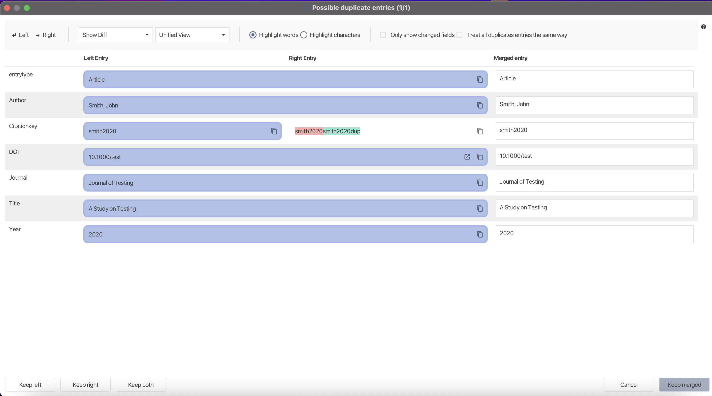
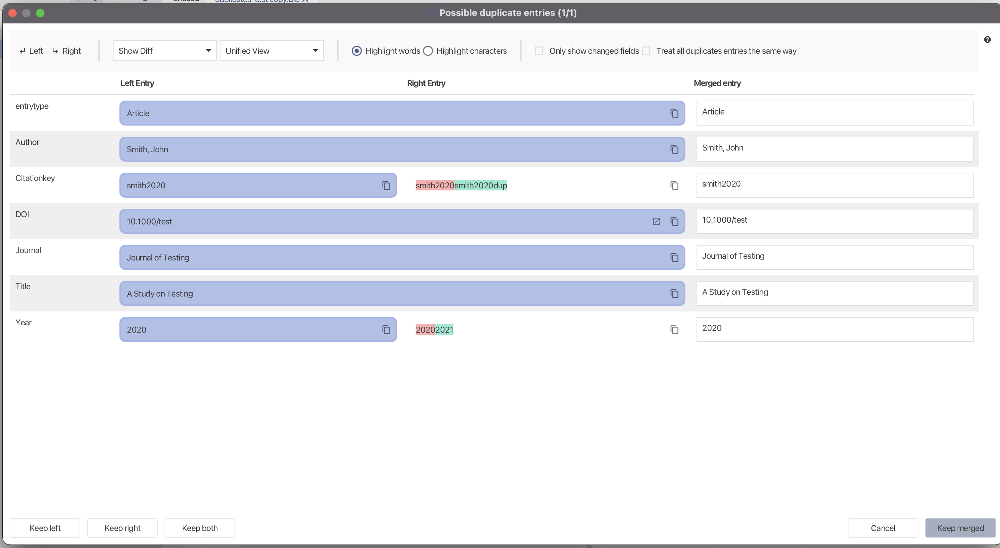
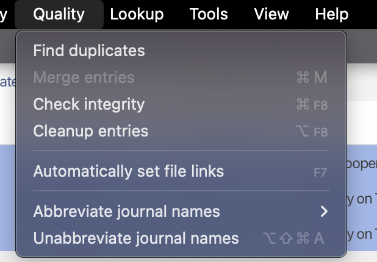
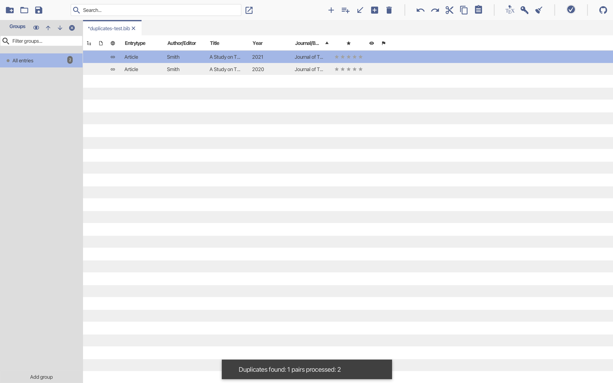

> [!IMPORTANT]
> This project does not accept fully AI-generated pull requests. AI tools may be used assistively only. You must understand and take responsibility for every change you submit.
>
> Read and follow:
> • [AGENTS.md](./AGENTS.md)
> • [CONTRIBUTING.md](./CONTRIBUTING.md)

# Phase 3 – Exploratory Testing: Duplicate Detection & Merge

## Goal

The goal of this phase is to evaluate the duplicate detection and merge functionality of JabRef from a user perspective using exploratory testing.

Exploratory testing focuses on interactive use of the system through the GUI rather than predefined test scripts. This allows the identification of usability issues, safety concerns, and unexpected behaviors that are not easily captured by automated tests.

This phase complements Phase 2 by validating how the feature behaves in practice when used by an end user.

---

## Exploratory Testing Method

Exploratory testing was conducted by interactively using JabRef’s graphical user interface while varying input data, user actions, and decision paths.

Test scenarios were designed based on:

- the inferred requirements defined in Phase 0
- typical user workflows (*happy paths*)
- invalid or unexpected user actions
- and edge cases involving incomplete or conflicting bibliographic data

No predefined test scripts were followed. Instead, observations were recorded during execution, focusing on correctness, user control, safety, and usability.

---

## Test Environment

- **Application:** JabRef (built from the repository main branch)
- **Execution method:** `./gradlew run`
- **Interface:** Desktop GUI
- **Test data:** Small BibTeX libraries manually created for:
  - exact duplicates,
  - near-duplicates,
  - conflicting metadata,
  - minimal metadata entries

---

## Exploratory Test Scenarios

The following exploratory scenarios were executed using the JabRef GUI.

### Scenario Results

| ID | Scenario | Action | Expected Behavior | Actual Behavior | Notes |
| ---- | --------- | -------- | ------------------- | ----------------- | ------- |
| S1 | Exact duplicates (happy path) | Find duplicates and merge identical entries | Duplicates detected and merged | As expected | Core functionality works correctly |
| S2 | Near-duplicates | Same title, different year | Consistent detection or exclusion | Detected depending on similarity | Behavior may be non-obvious to users |
| S3 | Conflicting metadata | Same title, different DOI/year | Field-by-field merge possible | As expected | Differences clearly highlighted |
| S4 | Cancel merge | Start merge, then cancel | Manual merge aborted | Duplicate pair still processed | Cancel does not fully preserve both entries |
| S5 | Invalid selection | Select more than two entries and try to merge | Operation blocked | Merge option disabled | Prevents unsafe operations |
| S6 | Keep both | Resolve duplicates using *Keep both* | Both entries preserved | As expected | Confirms explicit user control |
| S7 | Minimal metadata | Entries with only title and author | Duplicate detection still works | As expected | Robust against sparse data |
| S8 | Large merge dialog | Entries with many fields | Dialog remains usable | Requires scrolling | Minor usability friction |

---

## Screenshots and Evidence

Screenshots were collected during exploratory testing and stored in:
**docs/Assignmet_presentation/phase3-screenshots/**

### Screenshot 1 – Duplicate resolver (exact duplicates)

Duplicate detection dialog showing two identical entries and available resolution options.

---

### Screenshot 2 – Merge dialog with conflicting fields

Field-by-field merge dialog highlighting conflicting metadata between two entries.

---

### Screenshot 3 – Cancel merge behavior (observed system behavior)

When canceling the merge operation in the duplicate resolver, JabRef aborts manual field selection but still processes the duplicate pair. As a result, only one entry remains visible in the library after returning to the main view.

This behavior was observed consistently during exploratory testing and highlights that canceling does not fully preserve the original duplicate entries.

---

### Screenshot 4 – Invalid merge selection

Merge option disabled when more than two entries are selected, preventing unsafe operations.

---

### Screenshot 5 – Keep both entries

Result of resolving duplicates using the *Keep both* option, where both entries remain in the library.

---

## Findings and Observations

No critical functional defects were identified during exploratory testing.

However, one notable behavioral observation was recorded:

- Canceling the merge dialog does not fully revert duplicate processing. Although manual field selection is aborted, the duplicate pair is still considered processed, and only one entry remains visible.

Additional observations include:

- Duplicate detection sensitivity for near-duplicate entries may not always be obvious to users.
- Merge dialogs can become visually dense when entries contain many fields.
- User safety mechanisms (disabled actions, explicit *Keep both* option) are otherwise clearly enforced.

---

## Requirement Coverage

| Requirement | Covered by Scenarios |
| ------------ | --------------------- |
| **R1 – Duplicate detection** | S1, S2, S7 |
| **R2 – Presentation of duplicates** | S3 |
| **R3 – Safe merge operation** | S3, S4 |
| **R4 – User control and safety** | S4, S5, S6 |

---

## Phase 3 Conclusion

Exploratory testing confirms that JabRef’s duplicate detection and merge functionality behaves reliably under both normal and edge-case usage.

While no functional defects were discovered, exploratory testing revealed a non-obvious cancel behavior that may impact user expectations. Documenting this behavior demonstrates the value of exploratory testing in identifying usability and safety-related findings beyond purely functional correctness.
