# JabRef A2 — Testing Case Study Walkthrough

## 1. Project Context

- JabRef is an open-source reference manager (BibTeX/BibLaTeX) with a full GUI.
- It is actively maintained, has CI, and includes automated tests, which makes it a strong testing target.
- Data integrity matters because a wrong merge can silently corrupt citations across a library.

## 2. Scope and Feature Slice

- The project is too large to test end-to-end in a single assignment, so we scoped a feature slice.
- We chose duplicate detection + merge because it is high-risk and user-facing.
- The feature touches both core logic and GUI workflows, which makes it useful for testing decisions and coverage analysis.

## 3. Inferred Requirements (Test Oracle)

Inferred requirements were used as the test oracle:
- R1: Detect duplicates in a library (duplicate logic must identify likely matches).
- R2: Present duplicates clearly (user must be able to compare entries).
- R3: Merge safely (merged result must preserve correct data).
- R4: Provide user control (confirm, cancel, and undo should be available).

## 4. Phase 1 — Setup, Build, and Existing Tests

This phase confirms the project builds, runs, and tests pass before adding new testing work. Without a stable baseline, test results are not trustworthy.

Commands used:

- Build artifacts (fast, no tests):
```
./gradlew assemble
```
- Run the GUI:
```
./gradlew run
```
- Run core tests with CI settings:
```
CI=true ./gradlew :jablib:test
```
- Generate coverage report:
```
./gradlew jacocoTestReport
```

Coverage and CI notes:
- Coverage report output: `build/reports/jacoco/test/html/index.html`.
- Codecov configuration: `codecov.yml`.
- CI runs on GitHub Actions and includes a coverage workflow (disabled in `.github/workflows/tests-code.yml`).
- Codecov badge shows ~40% overall coverage on `main` (see the badge below).

Evidence screenshots:

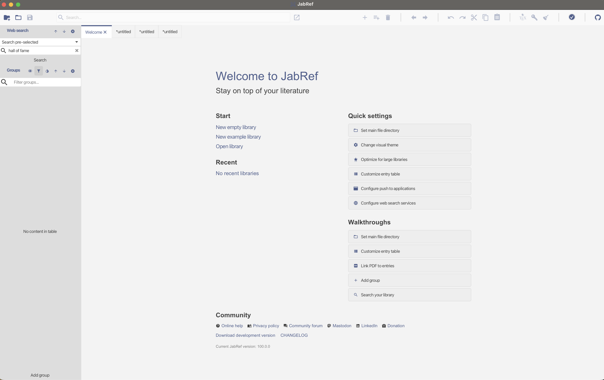
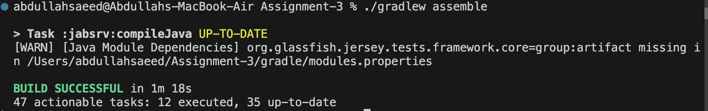
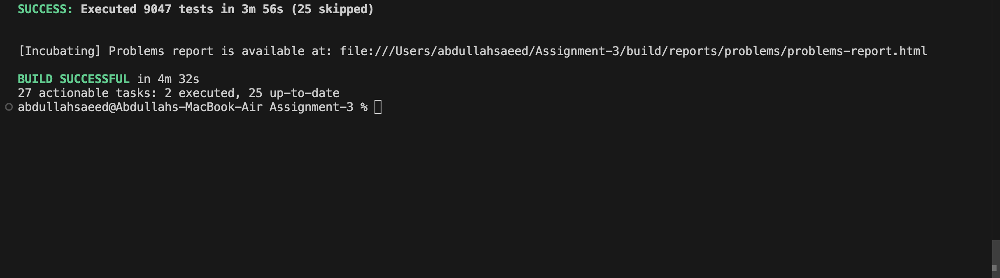
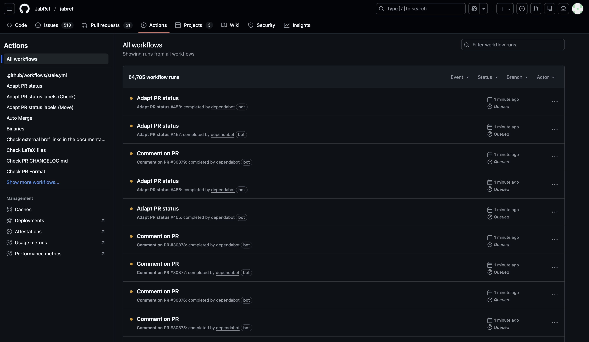
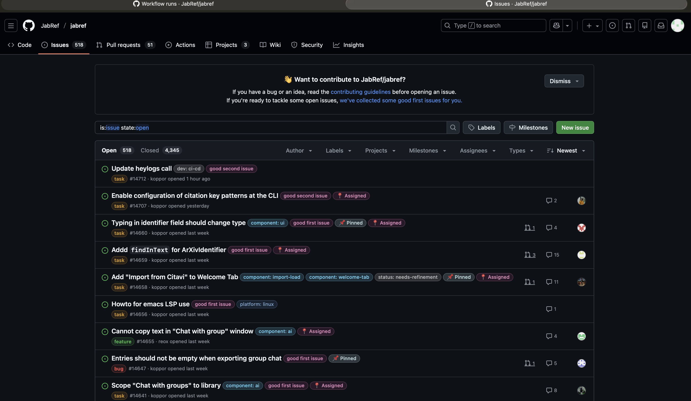


## 5. Phase 2 — Feature Slice to Code Mapping

Mapping GUI features to code is necessary to connect requirements to tests and locate gaps in coverage.

Key files and their purpose:
- `jablib/src/main/java/org/jabref/logic/database/DuplicateCheck.java` — core duplicate decision logic.
- `jabgui/src/main/java/org/jabref/gui/duplicationFinder/DuplicateSearch.java` — workflow for finding duplicates.
- `jabgui/src/main/java/org/jabref/gui/duplicationFinder/DuplicateResolverDialog.java` — UI dialog for resolving duplicates.
- `jabgui/src/main/java/org/jabref/gui/mergeentries/threewaymerge/MergeEntriesAction.java` — action that starts a merge.
- `jabgui/src/main/java/org/jabref/gui/mergeentries/threewaymerge/MergeTwoEntriesAction.java` — applies the merge and updates the database.

Existing tests and coverage:
- `jablib/src/test/java/org/jabref/logic/database/DuplicateCheckTest.java` — unit tests for duplicate logic.
- `jabgui/src/test/java/org/jabref/gui/externalfiles/ImportHandlerTest.java` — tests duplicate resolution decisions.
- `jabgui/src/test/java/org/jabref/gui/mergeentries/**` — view-model and merge support tests.

## 6. Phase 3 — Exploratory Testing

Exploratory testing is a user-driven approach that uncovers behaviors not covered by scripted or unit tests. It was chosen to validate GUI workflows and detect unexpected behavior.

Scenarios tested:
- Happy-path duplicates and merge.
- Near-duplicates with conflicting metadata.
- Canceling merge in the duplicate resolver.
- Invalid selection (merge blocked if not exactly two entries).
- Keep-both decision path.

Cancel-merge behavior:
- Canceling the merge dialog does not fully preserve both entries during the duplicate resolver flow.
- This is risky because it can surprise users and create silent data loss, even if it is not a confirmed bug.

Evidence screenshots:

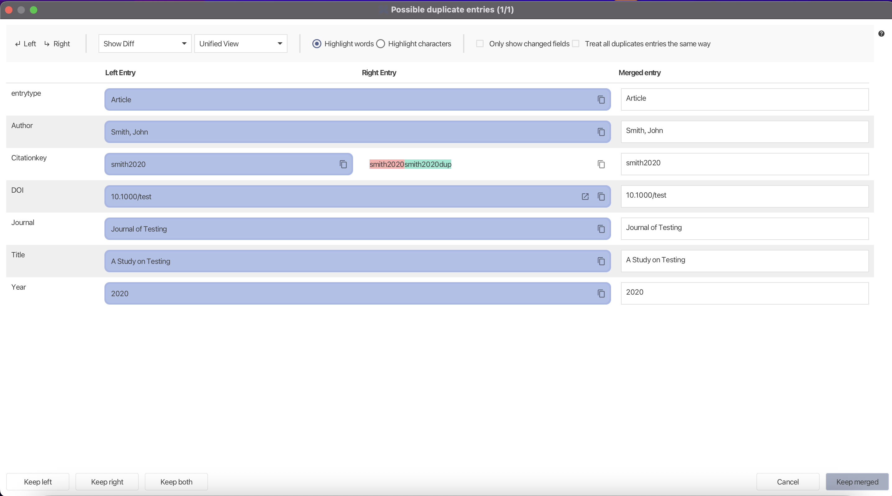
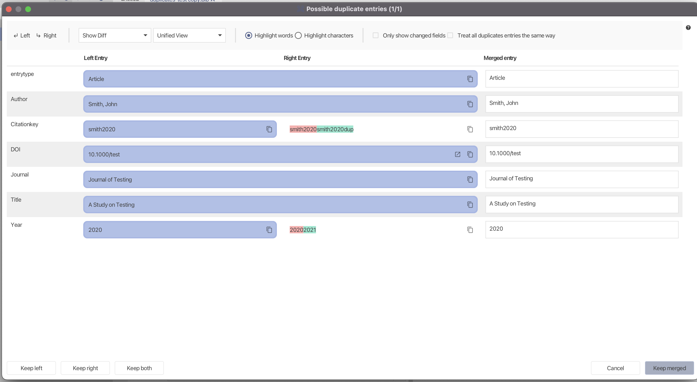
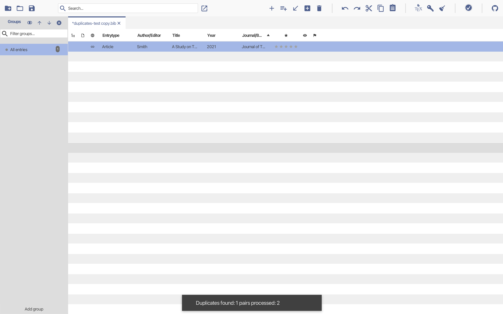
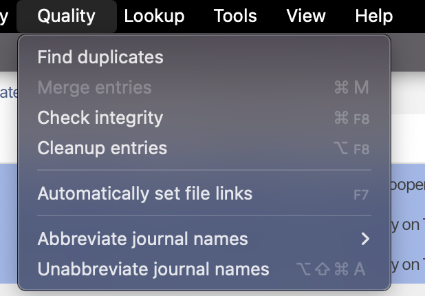
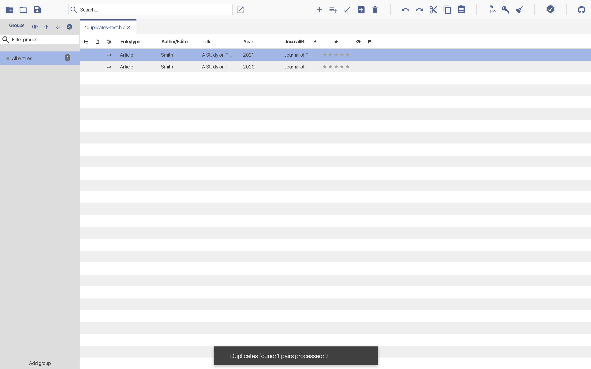

## 7. Phase 4 — New Automated Tests and Fixes

New tests were added to close the gaps identified in Phase 2. They are minimal and risk-driven, focused on safety and correctness.

New tests and purpose:
- `MergeTwoEntriesActionTest` — verifies merge side effects (insert merged entry, remove originals, undo edit created).
- `MergeEntriesActionTest` — verifies selection precondition (must select exactly two entries).
- `DuplicateSearchResultTest` — verifies duplicate bookkeeping for keep-merge results.

macOS fixes and why:
- `PushToTeXworksTest` — command line differs on macOS; test updated to match `open -a ... --args`.
- `KeyBindingsTabModelTest` — shortcut modifier is Command on macOS; test now OS-aware.

Commands to run individual tests:
```
CI=true ./gradlew :jabgui:test --tests org.jabref.gui.mergeentries.threewaymerge.MergeTwoEntriesActionTest
```
```
CI=true ./gradlew :jabgui:test --tests org.jabref.gui.mergeentries.threewaymerge.MergeEntriesActionTest
```
```
CI=true ./gradlew :jabgui:test --tests org.jabref.gui.duplicationFinder.DuplicateSearchResultTest
```
```
CI=true ./gradlew :jabgui:test --tests org.jabref.gui.push.PushToTeXworksTest
```
```
CI=true ./gradlew :jabgui:test --tests org.jabref.gui.keyboard.KeyBindingsTabModelTest
```

Evidence:
- `docs/Assignmet_presentation/phase4-new-automated-tests.md`
- `docs/Assignmet_presentation/tests-written/`

Evidence screenshots:

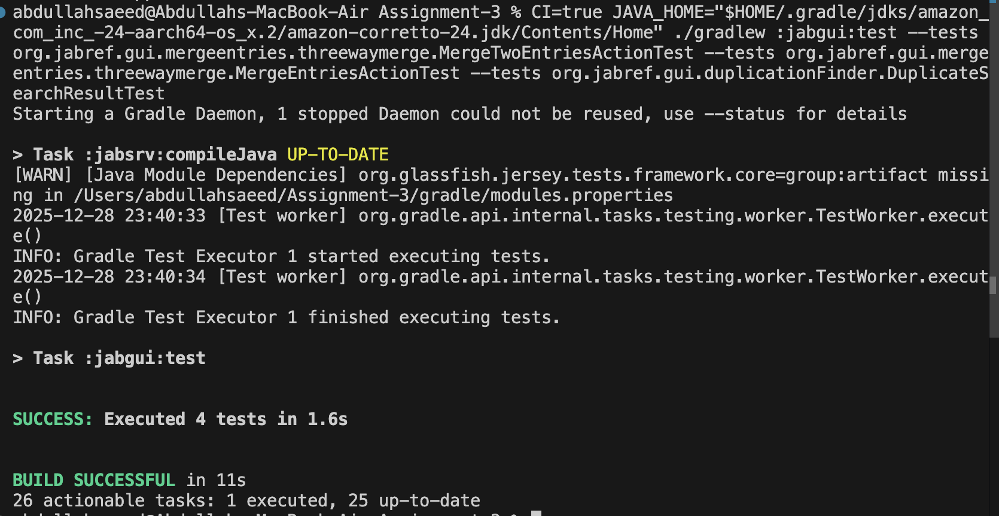
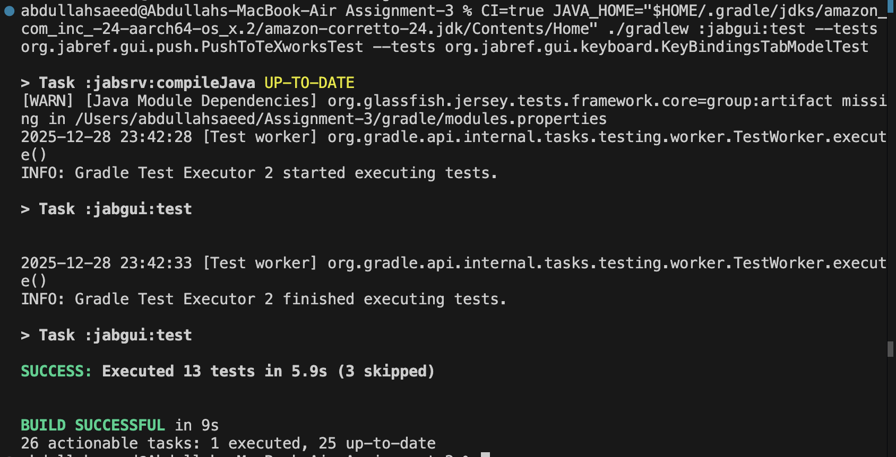

## 8. Phase 5 — Non-Functional Evaluation

- Reliability: merge and duplicate operations are undoable, reducing data-loss risk.
- Performance: duplicate search is O(n^2) for large libraries.
- Privacy: external communication is documented in `PRIVACY.md`.

Limitations:
- No performance benchmarks.
- No security audit.
- Limited cross-platform manual testing.

Evidence:
- `docs/Assignmet_presentation/phase5-nonfunctional-evaluation.md`

Evidence screenshots:

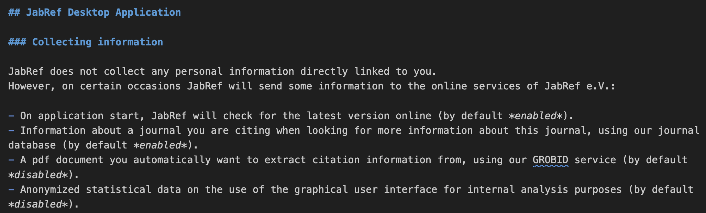

## 9. Summary — What This Testing Achieved

- Mapped a complex GUI feature slice to concrete code and tests.
- Confirmed baseline test health and coverage tooling.
- Discovered a risky cancel-merge behavior via exploratory testing.
- Added targeted automated tests to close safety gaps.
- Improved macOS test reliability.

Testing takeaway:
“Testing is about confidence, not coverage.”
